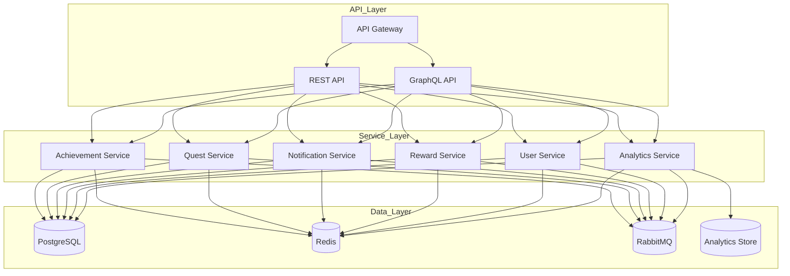
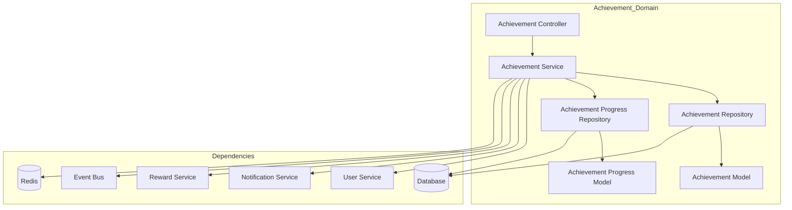
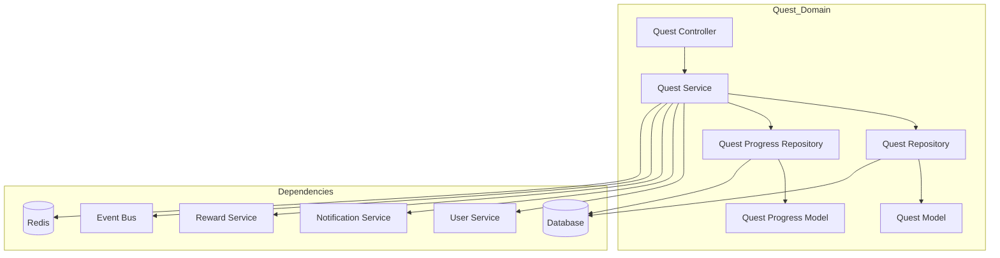
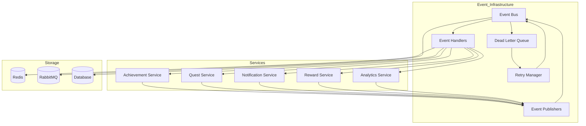
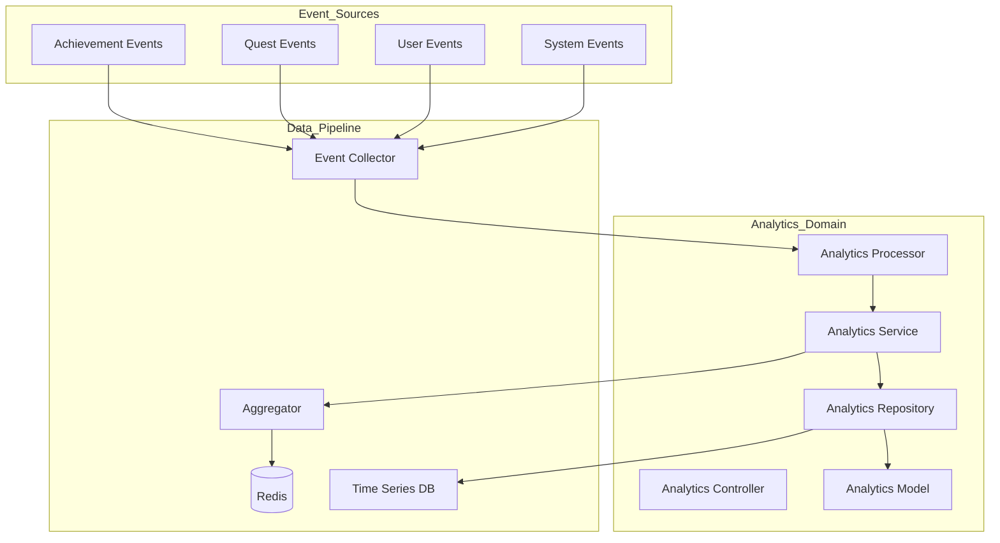
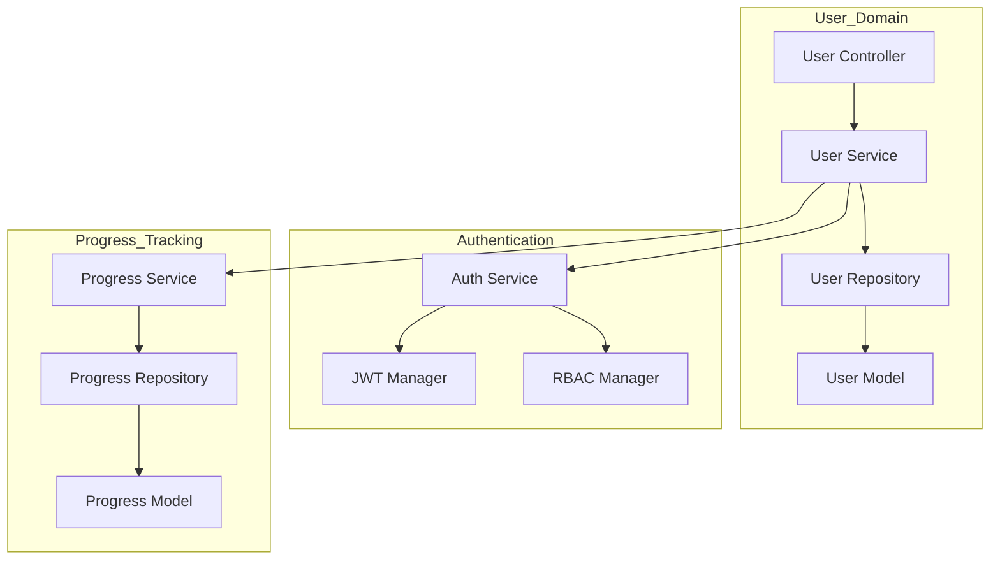
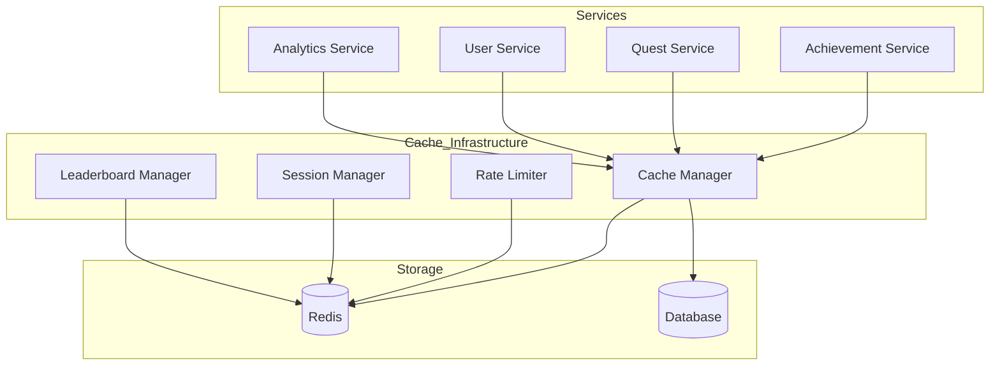
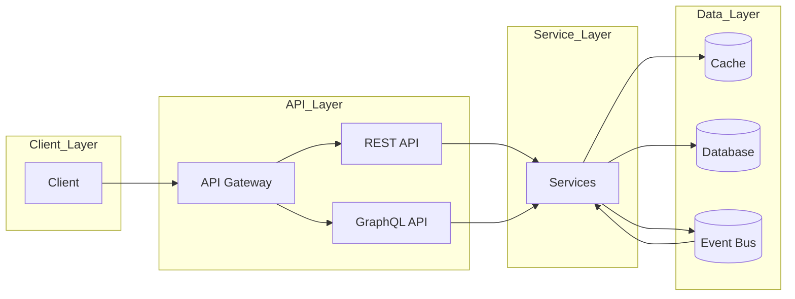
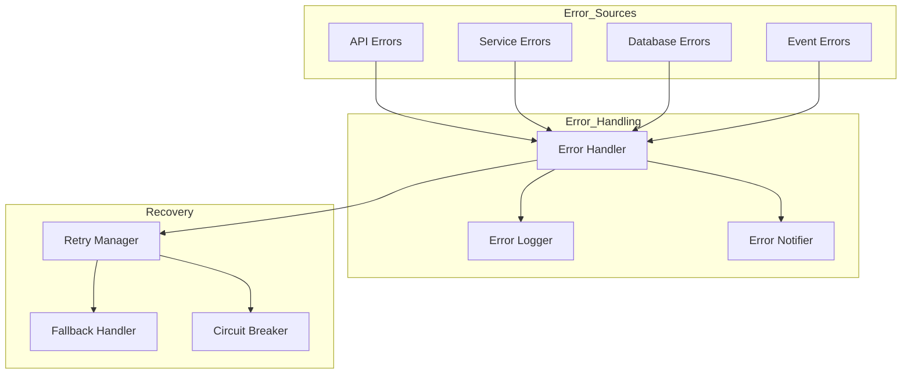
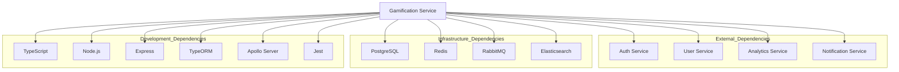

# Component Diagrams

## System Components Overview

### Core Service Components

### Achievement System Components

### Quest System Components

### Event System Components

### Analytics System Components

### User Management Components

### Caching Components

## Component Interactions

### Data Flow Patterns

### Error Handling Flow

## Component Dependencies

### Service Dependencies
