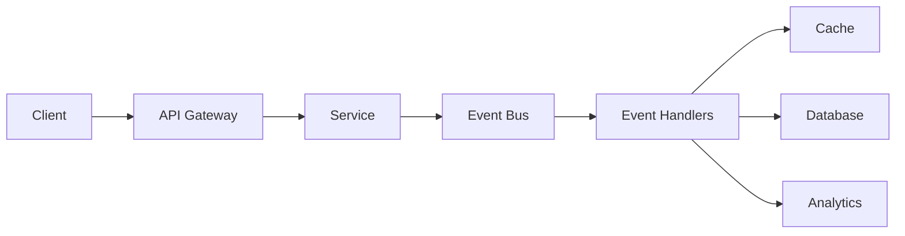
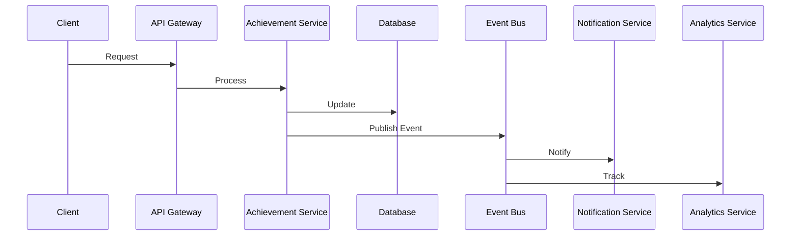
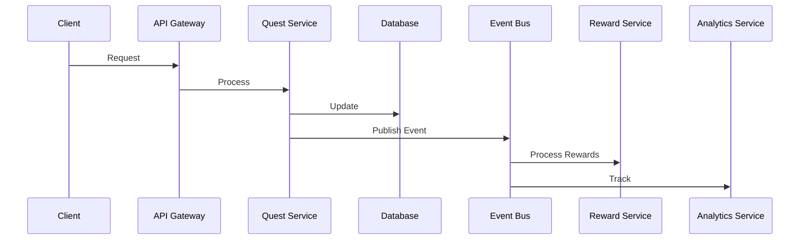

# Gamification Service Architecture Overview

## System Architecture

### Microservices Architecture
The Gamification service is part of a larger microservices ecosystem, designed with the following principles:
- Service independence and loose coupling
- Event-driven communication
- Domain-driven design
- Scalability and resilience

### Core Components

#### 1. API Layer
- **REST API**: Express-based RESTful endpoints
- **GraphQL API**: Apollo Server with federation support
- **API Gateway**: Kong Gateway for routing, authentication, and rate limiting

#### 2. Service Layer
- **Achievement Service**: Manages achievement lifecycle and progress
- **Quest Service**: Handles quest management and completion
- **Notification Service**: Manages user notifications
- **Analytics Service**: Tracks and processes user events
- **Reward Service**: Handles reward distribution
- **User Service**: Manages user profiles and progress

#### 3. Data Layer
- **Primary Database**: PostgreSQL with TypeORM
- **Cache Layer**: Redis for performance optimization
- **Event Store**: RabbitMQ for event persistence
- **Analytics Store**: Time-series database for metrics

### Infrastructure Components

#### 1. Event Bus (RabbitMQ)
- Topic-based exchanges for event routing
- Dedicated queues per service
- Dead letter queues for failed events
- Event persistence and retry mechanisms

#### 2. Caching Strategy (Redis)
- Query result caching
- Session management
- Rate limiting
- Real-time leaderboards

#### 3. Database Architecture
- Separate schemas per domain
- Migration management
- Read/write splitting
- Connection pooling

## Communication Patterns

### 1. Synchronous Communication
- REST API calls for direct requests
- GraphQL queries and mutations
- gRPC for inter-service communication

### 2. Asynchronous Communication
- Event-driven updates
- Message queues for background processing
- WebSocket for real-time updates

### 3. Event Flow

## Security Architecture

### 1. Authentication
- JWT-based authentication
- OAuth2 integration
- Role-based access control

### 2. API Security
- Rate limiting
- Request validation
- Input sanitization
- CORS configuration

### 3. Data Security
- Data encryption at rest
- Secure communication channels
- Audit logging

## Scalability Design

### 1. Horizontal Scaling
- Stateless services
- Load balancing
- Service replication

### 2. Performance Optimization
- Caching strategies
- Database indexing
- Query optimization
- Connection pooling

### 3. Resource Management
- Auto-scaling policies
- Resource quotas
- Circuit breakers

## Monitoring and Observability

### 1. Metrics Collection
- Service metrics
- Business metrics
- Performance metrics
- Error tracking

### 2. Logging
- Structured logging
- Log aggregation
- Error reporting
- Audit trails

### 3. Tracing
- Distributed tracing
- Request tracking
- Performance profiling

## Deployment Architecture

### 1. Container Orchestration
- Docker containerization
- Kubernetes orchestration
- Service mesh integration

### 2. CI/CD Pipeline
- Automated testing
- Continuous deployment
- Environment management
- Version control

### 3. Environment Strategy
- Development
- Staging
- Production
- Disaster recovery

## Data Flow

### 1. Achievement Flow

### 2. Quest Flow

## System Dependencies

### 1. External Services
- Authentication service
- User service
- Analytics service
- Notification service

### 2. Infrastructure Dependencies
- PostgreSQL
- Redis
- RabbitMQ
- Elasticsearch

### 3. Development Dependencies
- TypeScript
- Node.js
- Express
- TypeORM
- Apollo Server
- Jest

## Error Handling

### 1. Error Types
- Validation errors
- Business logic errors
- Infrastructure errors
- External service errors

### 2. Recovery Strategies
- Retry mechanisms
- Circuit breakers
- Fallback options
- Graceful degradation

### 3. Error Reporting
- Error logging
- Alert generation
- Error tracking
- Performance impact analysis

## Future Considerations

### 1. Planned Improvements
- WebSocket integration
- Real-time analytics
- Advanced caching strategies
- Performance optimizations

### 2. Scalability Enhancements
- Service mesh implementation
- Advanced monitoring
- Auto-scaling improvements
- Cache optimization

### 3. Technical Debt
- Code refactoring
- Test coverage
- Documentation updates
- Security enhancements 