# Sequence Diagrams

## Authentication Flows

### User Authentication
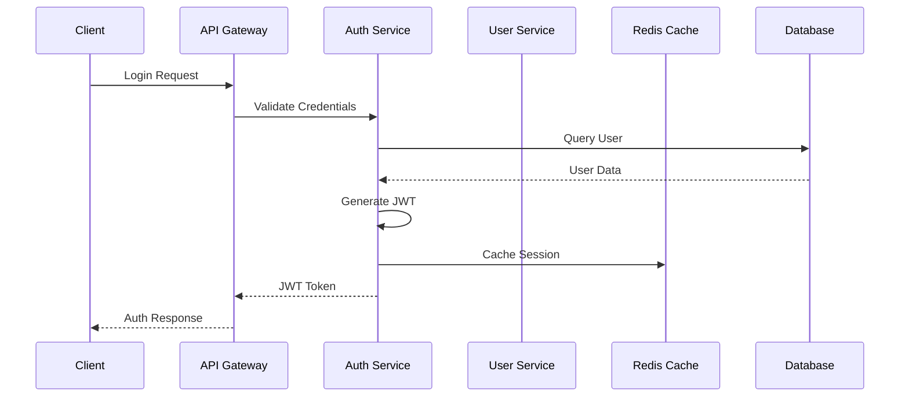

### Token Validation
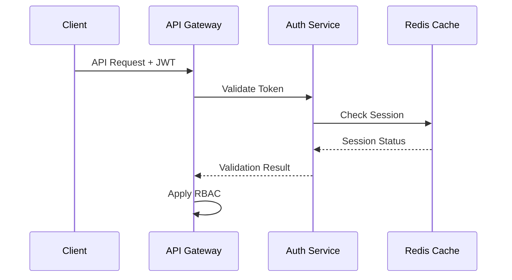

## Achievement System Flows

### Achievement Unlocking
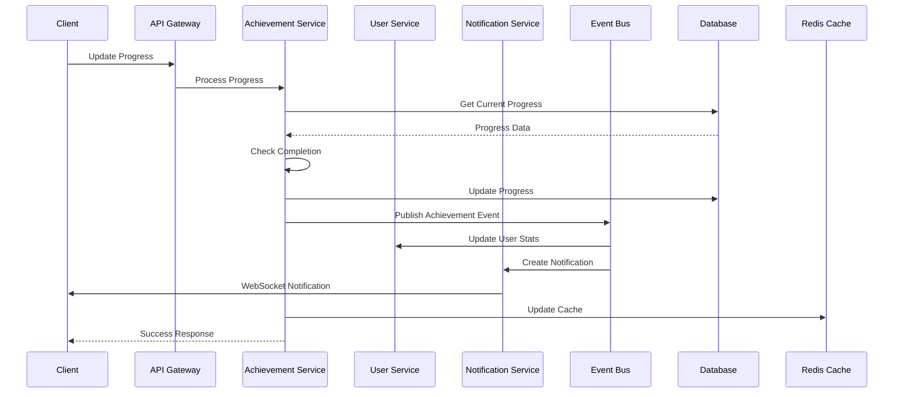

### Achievement Progress Tracking
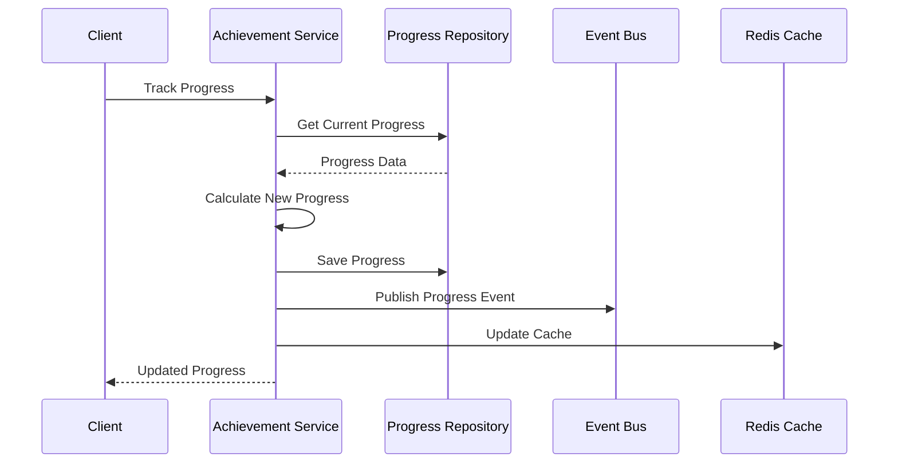

## Quest System Flows

### Quest Start Flow
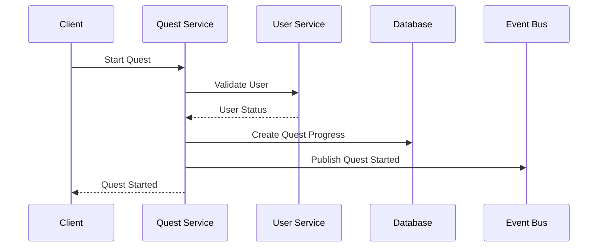

### Quest Completion
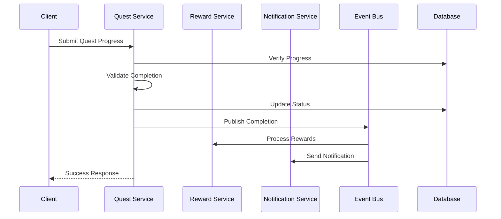

## Event Processing Flows

### Event Publication
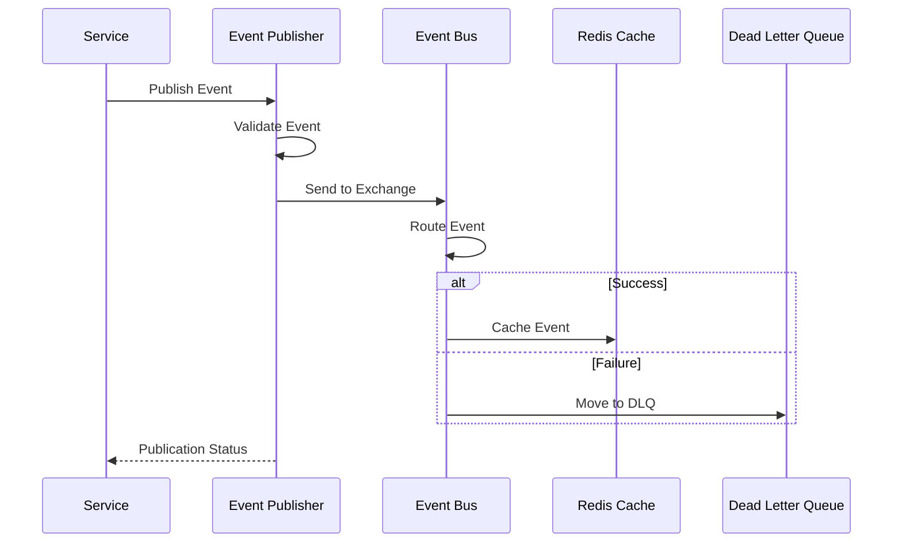

### Event Consumption
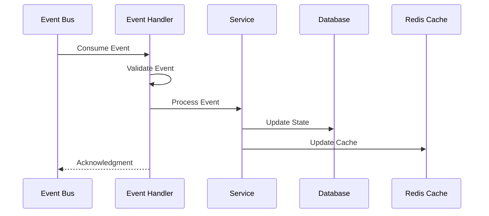

## Error Handling Flows

### API Error Handling
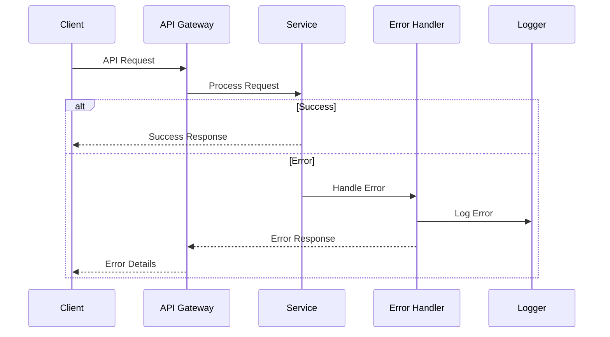

### Event Error Handling
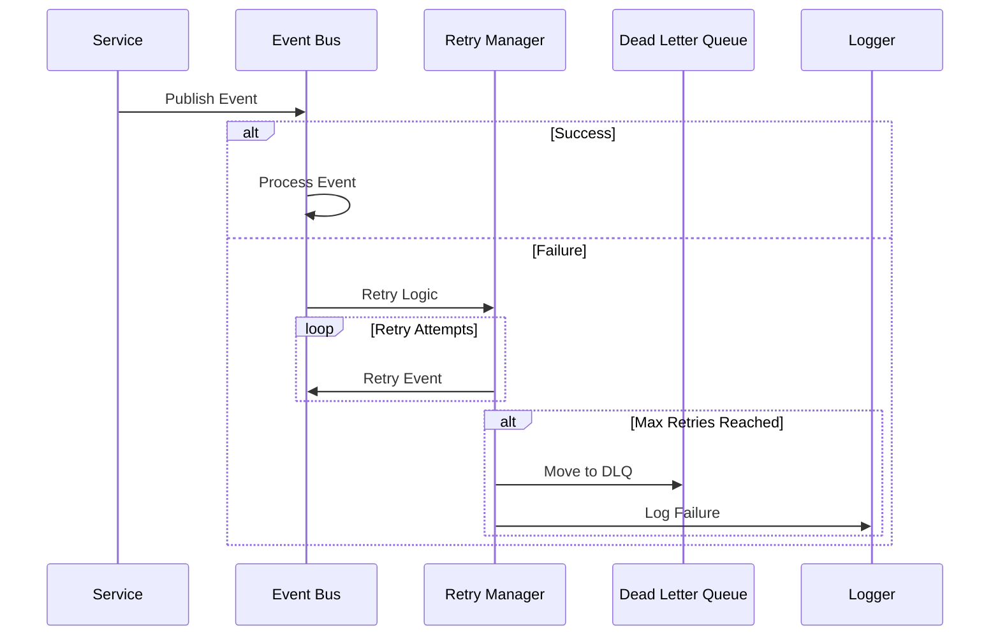

## Cache Management Flows

### Cache Operations
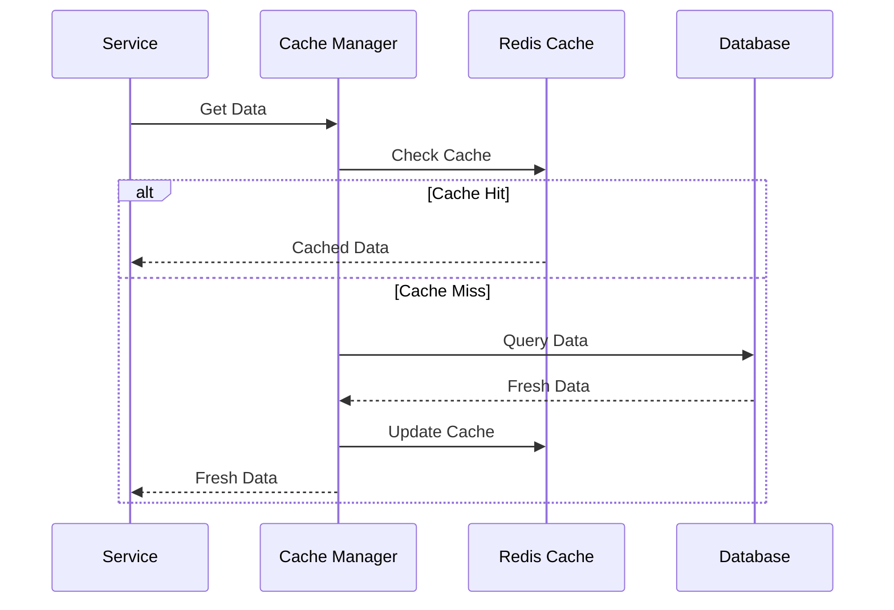

### Cache Invalidation
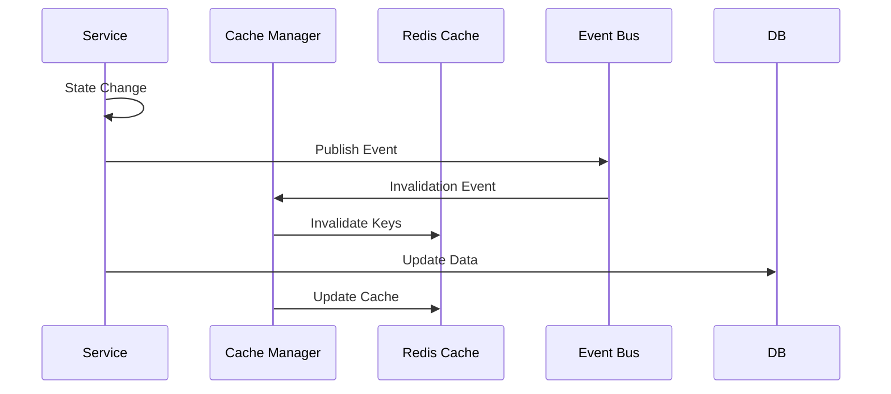

## Analytics Flows

### Event Tracking
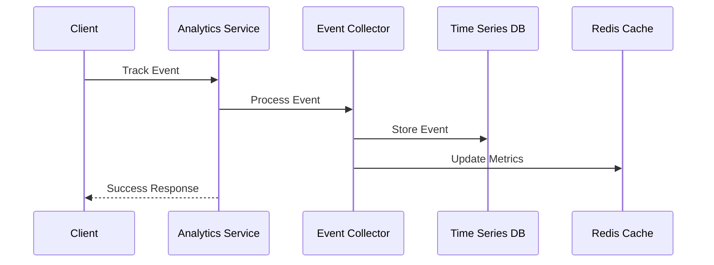

### Metrics Aggregation
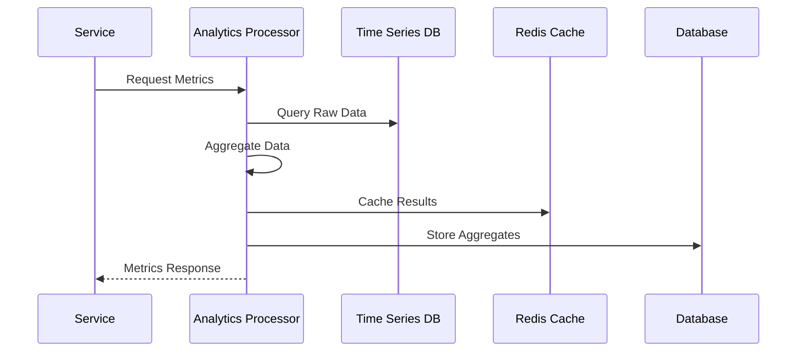