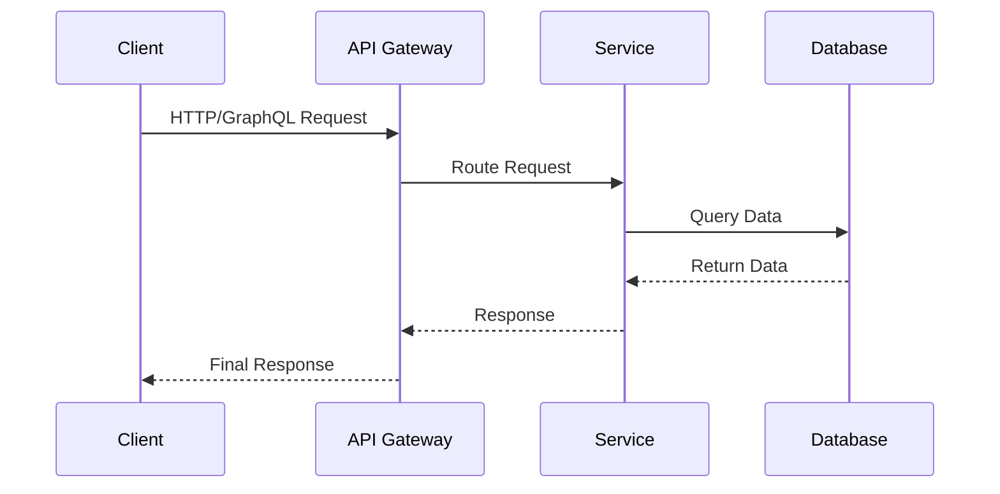
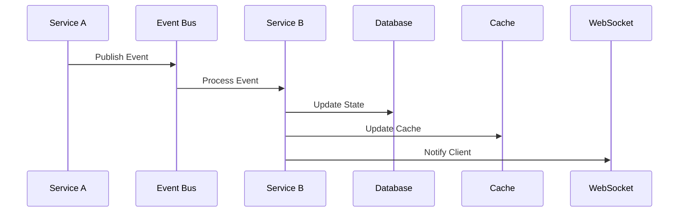
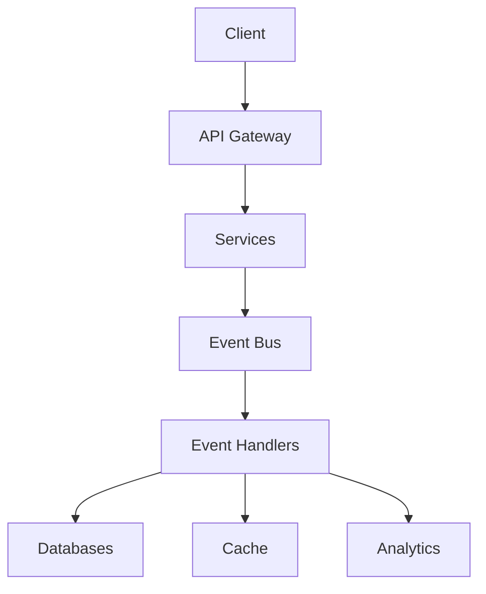

# SuperApp and Gamifier 2.0 Architecture Overview

## System Architecture

The SuperApp and Gamifier 2.0 platform is built on a modern, scalable microservices architecture designed to support high performance, reliability, and maintainability. The system consists of several key components working together to provide a seamless gaming and social experience.

### Core Components

#### Frontend Applications
- **SuperApp (Next.js)**
  - App Router for advanced routing
  - Server Components for optimal performance
  - Edge Functions for global distribution
  - Streaming SSR for improved UX

- **Gamifier (Vite)**
  - Hot Module Replacement (HMR)
  - ESBuild for fast builds
  - TypeScript support
  - Optimized for gaming features

#### Backend Services

1. **Gamification Service (Express)**
   - Achievement management
   - Quest system
   - Progress tracking
   - Reward distribution
   - Anti-cheat mechanisms

2. **Social Service (NestJS)**
   - Profile management
   - Connection handling
   - Activity tracking
   - Real-time notifications
   - GraphQL API with federation

3. **Analytics Service (Express)**
   - Event processing
   - Metrics collection
   - Real-time analytics
   - Reporting system
   - Performance monitoring

### Infrastructure Components

#### API Gateway (Kong)
- Rate limiting
- Authentication
- Request routing
- Analytics collection
- Load balancing
- Circuit breaking

#### Event Bus
- RabbitMQ for message queuing
- Redis for real-time events
- Dead letter queues
- Event persistence
- Retry mechanisms

#### Databases
- PostgreSQL for primary data
- Redis for caching
- Time-series DB for analytics
- Event store for CQRS

## Communication Patterns

### Synchronous Communication

### Asynchronous Communication

## Security Architecture

### Authentication
- JWT-based authentication
- Multi-factor authentication
- OAuth2 integration
- Session management
- Password policies

### Authorization
- Role-based access control (RBAC)
- Permission management
- Resource-level security
- API protection
- Audit logging

## Data Architecture

### Data Flow

### Data Storage
- Relational data in PostgreSQL
- Cache data in Redis
- Time-series data for analytics
- Event sourcing for CQRS
- File storage for media

## Scalability Design

### Horizontal Scaling
- Stateless services
- Load balancing
- Service replication
- Auto-scaling
- Resource quotas

### Performance Optimization
- Caching strategies
- Database indexing
- Query optimization
- Connection pooling
- Asset optimization

## Monitoring and Observability

### Metrics Collection
- Service metrics
- Business metrics
- Performance metrics
- Error tracking
- User analytics

### Logging and Tracing
- Structured logging
- Log aggregation
- Distributed tracing
- Error reporting
- Audit trails

## Deployment Architecture

### Container Orchestration
- Docker containerization
- Kubernetes orchestration
- Service mesh
- Auto-scaling
- Health checks

### CI/CD Pipeline
- Automated testing
- Continuous deployment
- Environment management
- Version control
- Rollback procedures

## System Dependencies

### External Services
- Authentication providers
- Storage services
- CDN services
- Analytics platforms
- Payment processors

### Development Dependencies
- TypeScript
- Node.js
- Express/NestJS
- React/Next.js
- Testing frameworks

## Error Handling

### Strategies
- Retry mechanisms
- Circuit breakers
- Fallback options
- Graceful degradation
- Error reporting

### Recovery Procedures
- Automated recovery
- Manual intervention
- Data consistency
- State reconciliation
- Incident response

## Future Considerations

### Planned Improvements
- Edge computing integration
- Machine learning features
- WebAssembly optimization
- Blockchain integration
- IoT device support

### Technical Debt
- Code refactoring
- Test coverage
- Documentation updates
- Security enhancements
- Performance optimization 