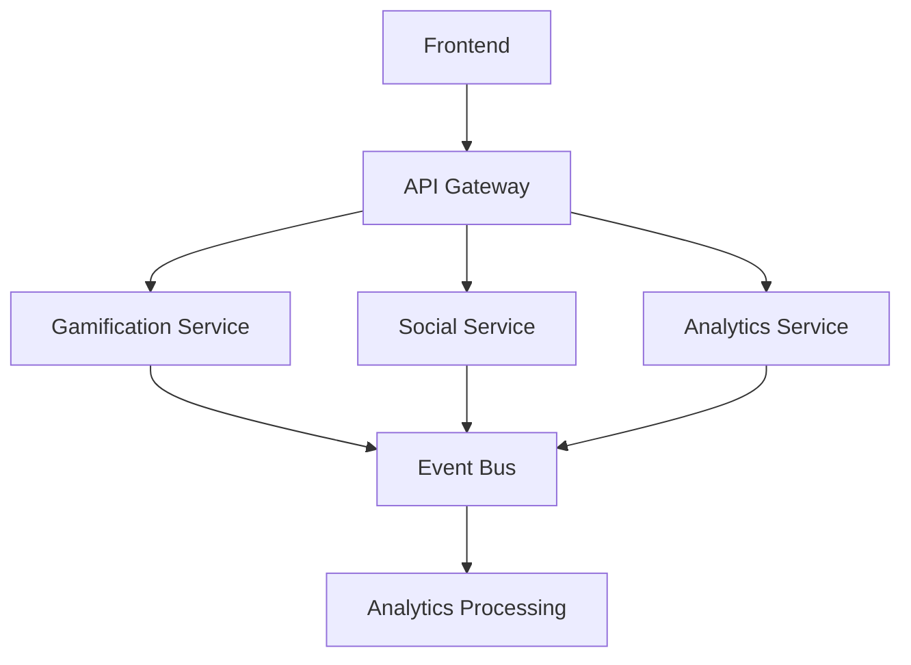

# Core Architecture Guide

## Overview
The SuperApp and Gamifier 2.0 system follows a microservices architecture with the following key components:
- Frontend applications using Next.js and Vite
- Backend services using NestJS and Express
- Event-driven communication
- GraphQL federation
- Enterprise-grade API gateway

## Service Architecture

### Frontend Services
```typescript
interface FrontendArchitecture {
  superApp: {
    framework: 'Next.js';
    runtime: 'Edge' | 'Node.js';
    features: [
      'App Router',
      'Server Components',
      'Edge Functions',
      'Streaming SSR'
    ];
  };
  gamifier: {
    framework: 'Vite';
    runtime: 'Node.js';
    features: [
      'HMR',
      'ESBuild',
      'TypeScript'
    ];
  };
}
```

### Backend Services
```typescript
interface BackendArchitecture {
  gamification: {
    runtime: 'Node.js';
    framework: 'Express';
    features: [
      'WebSocket',
      'Event-Driven',
      'Real-time Updates'
    ];
  };
  social: {
    runtime: 'Node.js';
    framework: 'NestJS';
    features: [
      'GraphQL',
      'WebSocket',
      'CQRS'
    ];
  };
  analytics: {
    runtime: 'Node.js';
    framework: 'Express';
    features: [
      'Stream Processing',
      'Time Series',
      'Real-time Analytics'
    ];
  };
}
```

## Communication Patterns

### Synchronous Communication
- REST API calls for direct requests
- GraphQL queries and mutations
- gRPC for inter-service communication

### Asynchronous Communication
- Event-driven updates via Redis and RabbitMQ
- Message queues for background processing
- WebSocket for real-time updates

## Infrastructure Components

### API Gateway (Kong)
- Rate limiting
- Authentication
- Analytics
- Load balancing
- Circuit breaking

### Event Bus
- Redis for primary event bus (Pub/Sub)
- RabbitMQ for backup and complex routing
- Dead letter queues
- Event persistence

### Databases
- PostgreSQL for primary data storage
- Redis for caching and real-time features
- Time-series DB for analytics
- Event store for CQRS

## Service Dependencies


## Related Guides
- [State Management Guide](state-management.md)
- [Event System Guide](event-system.md)
- [API Gateway Guide](api-gateway.md)
- [Service Implementation Guides](../services/) 