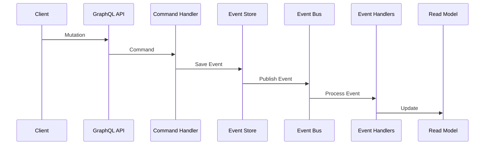

# Social Service Guide

## Overview
The Social Service is built with NestJS and provides social features like profiles, connections, activities, and notifications. It uses GraphQL for API queries and CQRS for command handling.

## Core Features
- Profile management
- Connection/following system
- Activity tracking
- Real-time notifications
- Social graph analytics

## Technical Stack
- NestJS framework
- PostgreSQL database
- Redis for caching
- GraphQL with Apollo Federation
- CQRS pattern
- WebSocket for real-time features

## Implementation

### Domain Models

#### Profile
```typescript
interface Profile {
  id: string;
  userId: string;
  displayName: string;
  bio?: string;
  avatarUrl?: string;
  interests?: string[];
  connectionCount: number;
  activityCount: number;
  isVerified: boolean;
  isActive: boolean;
  lastSeenAt?: Date;
  settings?: Record<string, any>;
  badges?: string[];
}
```

#### Connection
```typescript
enum ConnectionStatus {
  PENDING = 'PENDING',
  ACCEPTED = 'ACCEPTED',
  REJECTED = 'REJECTED',
  BLOCKED = 'BLOCKED'
}

interface Connection {
  id: string;
  followerId: string;
  followingId: string;
  status: ConnectionStatus;
  note?: string;
  isFavorite: boolean;
  notificationsEnabled: boolean;
}
```

#### Activity
```typescript
enum ActivityType {
  POST = 'POST',
  COMMENT = 'COMMENT',
  LIKE = 'LIKE',
  SHARE = 'SHARE',
  FOLLOW = 'FOLLOW',
  ACHIEVEMENT = 'ACHIEVEMENT',
  QUEST_COMPLETION = 'QUEST_COMPLETION',
  REWARD_EARNED = 'REWARD_EARNED',
  PROFILE_UPDATE = 'PROFILE_UPDATE',
  CUSTOM = 'CUSTOM'
}

interface Activity {
  id: string;
  profileId: string;
  type: ActivityType;
  title: string;
  description?: string;
  metadata?: Record<string, any>;
  visibility: 'PUBLIC' | 'CONNECTIONS' | 'PRIVATE';
}
```

#### Notification
```typescript
enum NotificationType {
  FOLLOW = 'FOLLOW',
  LIKE = 'LIKE',
  COMMENT = 'COMMENT',
  MENTION = 'MENTION',
  ACHIEVEMENT = 'ACHIEVEMENT',
  QUEST = 'QUEST',
  REWARD = 'REWARD',
  SYSTEM = 'SYSTEM'
}

interface Notification {
  id: string;
  profileId: string;
  type: NotificationType;
  title: string;
  message?: string;
  data?: Record<string, any>;
  isRead: boolean;
  isArchived: boolean;
}
```

## Architecture

### CQRS Implementation
```typescript
// Commands
interface CreateProfileCommand {
  userId: string;
  displayName: string;
  bio?: string;
}

interface UpdateProfileCommand {
  id: string;
  displayName?: string;
  bio?: string;
  avatarUrl?: string;
}

// Queries
interface GetProfileQuery {
  id?: string;
  userId?: string;
}

interface GetConnectionsQuery {
  profileId: string;
  status?: ConnectionStatus;
  page?: number;
  limit?: number;
}
```

### Event Flow


## Integration Points

### GraphQL Federation
```graphql
type Profile @key(fields: "id") {
  id: ID!
  userId: String!
  displayName: String!
  connections: [Connection!]!
  activities: [Activity!]!
  notifications: [Notification!]!
}

extend type User @key(fields: "id") {
  id: ID! @external
  profile: Profile!
}
```

### Event Bus Integration
```typescript
interface SocialEvent {
  id: string;
  type: string;
  timestamp: Date;
  data: Record<string, any>;
  metadata?: Record<string, any>;
}

// Event types
type ProfileCreatedEvent = SocialEvent & { type: 'profile.created' };
type ConnectionCreatedEvent = SocialEvent & { type: 'connection.created' };
type ActivityCreatedEvent = SocialEvent & { type: 'activity.created' };
type NotificationCreatedEvent = SocialEvent & { type: 'notification.created' };
```

## Configuration

### Environment Variables
```env
# Server
PORT=3001
NODE_ENV=development

# Database
DB_HOST=localhost
DB_PORT=5432
DB_USERNAME=postgres
DB_PASSWORD=postgres
DB_DATABASE=social_service

# Redis
REDIS_HOST=localhost
REDIS_PORT=6379

# Event Bus
RABBITMQ_URL=amqp://localhost:5672
RABBITMQ_EXCHANGE=social_events

# GraphQL
GRAPHQL_PLAYGROUND=true
GRAPHQL_DEBUG=true

# Security
JWT_SECRET=your-secret-key
JWT_EXPIRES_IN=1d
```

## Related Guides
- [Core Architecture](../core/architecture.md)
- [Event System](../core/event-system.md)
- [GraphQL Federation](../core/graphql.md)
- [CQRS Pattern](../patterns/cqrs.md) 